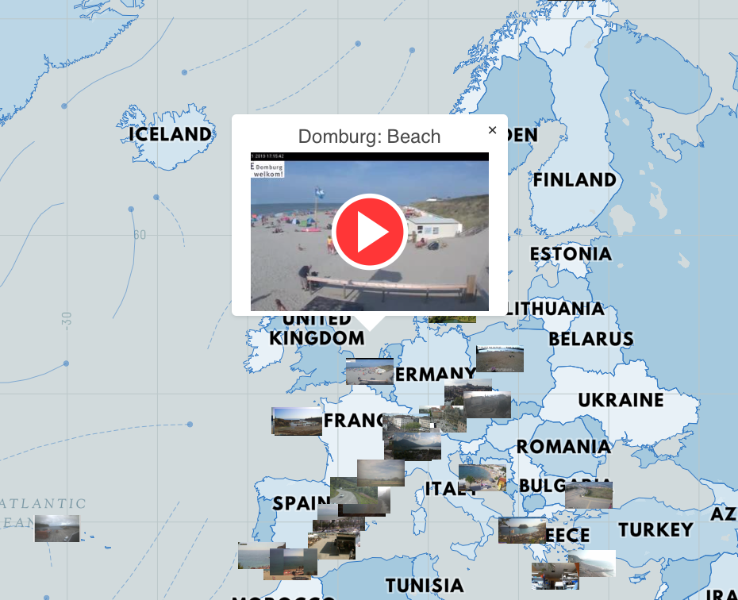

​
# Software Engineering Immersive: Project 2
This was the second project during the General Assembly Software Engineering Immersive course (Week 5). The project was made in collaboration with Gaetano https://github.com/gaebar/
​
## Timeframe & Team
​
48h, pair programming
​
## Built With
​
* React
* Axios
* Insomnia
* Webpack
* HTML5
* CSS
* Bulma
* Teletype
* Heroku

## Deployment
​
Our website is deployed on Heroku and it can be found here: http://digital-nomad-ga.herokuapp.com/

## Brief
​
Build a React application that consumes a public API.

Have several components - At least one classical and one functional.

The app should include a router - with several "pages".

Have semantically clean HTML.

Be deployed online and accessible to the public.

Work in pairs.

## Approach:

As this was a pair coded 'reactathon' with a very limited timeframe, we chose was to focus on functionality. For styling we used Bulma which was very helpful.

Most of our coding was done on one laptop, so we discussed each piece of code and the best approaches. We also used the Teletype team coding tool.

## Process

The core idea was to used Webcamstravel API https://webcamstravel.p.rapidapi.com/ and render it on a map (for which we used Mapbox). Webcam API gave us access to public cameras from all over the world. We used geographic coordinates to show markers of the camera's locations on the map. After an user clicks a marker in desired location a popup appears showing more details. User can click on the camera image to see a live view from this particular camera in a new window.

## Challenges

Webcamstravel allows to access just fifty cameras at the same time. We decided at the first render to show 50 most popular cameras in the world. Then fifty most popular in the 200km radius from the place where a user clicks.
